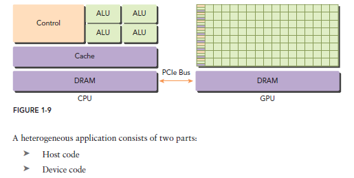
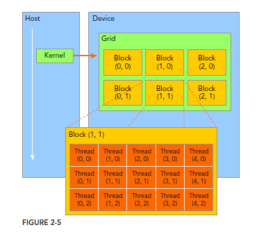

# Important Concepts

In this project, we will cover CUDA programming from the basics to advanced concepts using the C programming language. The goal is to understand how to execute computations directly on the GPU to accelerate parallel workloads.

## Host and Device


CUDA programs execute on two different processors:

* **Host:** The CPU, responsible for running the main application, managing memory, and launching GPU kernels.
* **Device:** The GPU, responsible for executing thousands of threads in parallel.

The CPU prepares the data and transfers it to the GPU. Once the computation is complete, the results are copied back from the GPU to the CPU.

```
CPU (Host)
    |
    |  Transfer data
    v
GPU (Device)
    |
    |  Execute parallel computation
    v
Results returned to the CPU
```

## CPU vs GPU

The CPU is designed for low-latency execution and is optimized for sequential tasks, complex logic, and operating system management.

The GPU is designed for high-throughput computing. It contains thousands of lightweight cores that can execute many threads simultaneously, making it ideal for data-parallel algorithms where the same operation is performed on many data elements.

### Typical Use Cases

**CPU**

* Complex decision-making
* Sequential algorithms
* Input/Output operations
* Operating system tasks

**GPU**

* Matrix operations
* Image and video processing
* Scientific computing
* Machine learning and deep learning
* Physics simulations
* Large-scale parallel computations

## GPU Execution Model


CUDA organizes the execution of parallel programs into a hierarchy of threads, blocks, and grids.

### Thread

A **thread** is the smallest execution unit on the GPU. Each thread executes the same kernel (function) but operates on different data. Every thread has a unique identifier (`threadIdx`) that allows it to determine which portion of the data it should process.

### Block

A **block** is a group of threads that execute on the same Streaming Multiprocessor (SM). Threads within the same block can:

* Communicate through **shared memory**.
* Synchronize their execution using `__syncthreads()`.

Blocks are independent of one another, allowing the GPU to schedule them efficiently across multiple SMs.

### Grid

A **grid** is a collection of one or more blocks. When a CUDA kernel is launched, the programmer specifies the number of blocks in the grid and the number of threads in each block.

```
Grid
 ├── Block 0
 │    ├── Thread 0
 │    ├── Thread 1
 │    └── ...
 ├── Block 1
 │    ├── Thread 0
 │    ├── Thread 1
 │    └── ...
 └── ...
```

### Warp

A **warp** is a group of **32 threads** within a block that execute instructions together on the GPU. The GPU schedules and executes threads at the warp level, not individually.

For maximum performance, threads within a warp should follow the same execution path. If different threads in the same warp take different branches of an `if` statement, the warp experiences **branch divergence**, which can reduce performance.
## GPU Memory Hierarchy

CUDA provides several types of memory, each with different sizes, lifetimes, and access speeds. Choosing the appropriate memory type is one of the most important factors in achieving high performance.

### Registers

Registers are the **fastest memory** available on the GPU. Each thread has its own private registers, which are used to store frequently accessed variables during execution. Registers are allocated automatically by the compiler and cannot be shared between threads.

### Shared Memory

Shared memory is an **on-chip memory** shared by all threads within the same block. It is much faster than global memory and allows threads to cooperate by sharing intermediate results.

Shared memory is commonly used to:

* Reduce accesses to global memory.
* Cache frequently used data.
* Implement efficient algorithms such as **tiling**, **parallel reductions**, and **matrix multiplication**.

### Local Memory

Despite its name, local memory is **not physically local to the GPU cores**. It resides in global memory and is used when a thread requires more registers than are available or when large local arrays are declared. Accessing local memory is much slower than accessing registers.

### Constant Memory

Constant memory is a small, **read-only** memory space that is initialized by the CPU before launching a kernel. It is optimized for the case where many threads read the same value simultaneously, making it ideal for constants such as coefficients or lookup tables.

### Texture Memory

Texture memory is another **read-only cached memory** optimized for spatial locality. It is commonly used in image processing, computer graphics, and applications where neighboring threads access nearby memory locations.

### Global Memory

Global memory is the **largest memory space** on the GPU and is accessible by every thread and by the CPU. All data transferred from the host (CPU) to the device (GPU) is typically stored in global memory.

Although global memory has a large capacity, it also has the **highest access latency**. Frequent reads and writes to global memory can significantly reduce application performance.

## Why Shared Memory Improves Performance

When a CUDA kernel starts, the input data is usually stored in **global memory**. Each thread reads the data it needs from global memory to perform its computation.

If many threads repeatedly access the same data, reading directly from global memory becomes inefficient because global memory accesses are relatively slow.

A common optimization is to first **load the required data into shared memory**. Since shared memory is located on the Streaming Multiprocessor (SM), all threads in the same block can access it much faster.

The typical execution flow is:

```text
Host (CPU)
      │
      ▼
Global Memory (GPU)
      │
      │ Load once
      ▼
Shared Memory (per Block)
      │
      ▼
Threads perform computations
```

By loading data from global memory only once and reusing it from shared memory, the number of expensive global memory accesses is greatly reduced.

## Common Optimization Techniques

### Tiling

**Tiling** divides a large dataset into smaller blocks, called *tiles*. Each block of threads loads one tile from global memory into shared memory, performs all required computations, and then loads the next tile.

This technique is widely used in:

* Matrix multiplication
* Image processing
* Convolution operations
* Stencil computations

The main advantage of tiling is that each value loaded from global memory can be reused many times by different threads.

### Parallel Reduction

A **parallel reduction** combines many values into a single result, such as computing the sum, maximum, or minimum of an array.

Instead of every thread repeatedly accessing global memory, threads first load data into shared memory and then cooperatively reduce the values using synchronization (`__syncthreads()`). This significantly decreases memory traffic and improves performance.

Reduction is commonly used for:

* Summation
* Dot products
* Maximum and minimum values
* Statistical computations
* Machine learning algorithms
